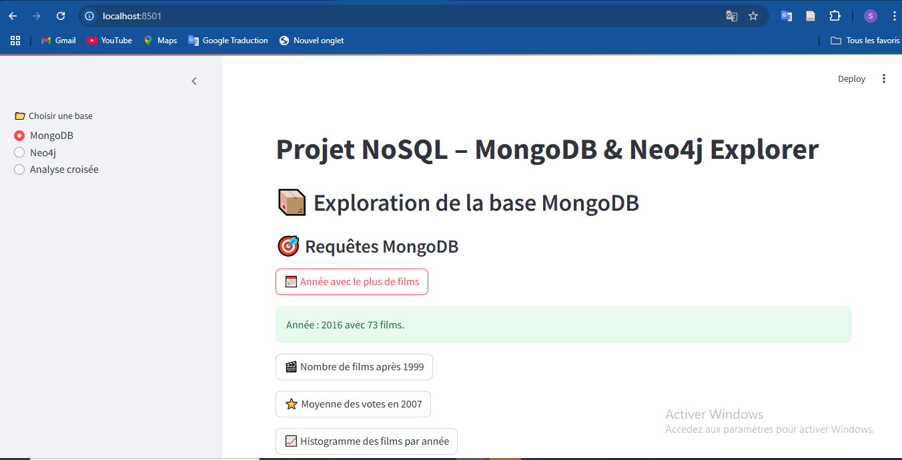

# Projet NoSQL : Exploration et Interrogation de Bases de Données NoSQL avec Python

## Aperçu de l'application

Voici un aperçu de l'interface de l'application :



## Fonctionnalités

L'application vous permet de :

- **Analyser** les films dans MongoDB et Neo4j.
- **Explorer** les genres, les réalisateurs et les acteurs.
- **Recommander** des films en fonction des genres préférés d'un acteur.


Ce projet vise à explorer et à interroger deux systèmes de gestion de bases de données NoSQL : **MongoDB** et **Neo4j**, en utilisant Python. Le but est de créer une application capable de récupérer, analyser et visualiser des données provenant des deux bases de données.

## Technologies utilisées

- **Python 3.x**
- **MongoDB** - Base de données NoSQL orientée documents
- **Neo4j** - Base de données NoSQL orientée graphes
- **Streamlit** - Framework pour créer des interfaces web interactives
- **Py2neo** - Client Python pour interagir avec Neo4j
- **PyMongo** - Client Python pour interagir avec MongoDB

## Prérequis

### Installation des dépendances

1. **Créer un environnement virtuel** (recommandé) :
   ```bash
   python -m venv venv
   ```

2. **Activer l'environnement virtuel** :
   - **Windows** :
     ```bash
     venv\Scripts\activate
     ```
   - **macOS/Linux** :
     ```bash
     source venv/bin/activate
     ```

3. **Installer les dépendances nécessaires** :
   ```bash
   pip install -r requirements.txt
   ```

### Configuration des bases de données

1. **MongoDB** : Assurez-vous que MongoDB est installé et en cours d'exécution. Vous pouvez le démarrer avec la commande suivante :
   ```bash
   mongod
   ```

2. **Neo4j** : Assurez-vous que Neo4j est installé et en cours d'exécution. Vous pouvez télécharger Neo4j Desktop depuis [ici](https://neo4j.com/download/).

3. **Mise à jour des informations de connexion** :
   - Pour **MongoDB**, modifiez les informations de connexion dans `config/config.py`.
   - Pour **Neo4j**, mettez à jour l'URL et les informations d'utilisateur dans `config/config.py`.

## Fonctionnalités

### 1. **Connexion et test des bases de données**
   - Se connecter à MongoDB et Neo4j, tester la connexion avec un bouton de validation dans l'interface Streamlit.

### 2. **Exploration de MongoDB**
   - Afficher la liste des films présents dans MongoDB.
   - Analyser les films par genre, note, et acteurs.
   - Ajouter, mettre à jour et supprimer des documents.

### 3. **Exploration de Neo4j**
   - Lister les films, réalisateurs et acteurs dans la base Neo4j.
   - Créer des relations entre les films, genres, acteurs et réalisateurs.
   - Rechercher les films ayant des genres en commun mais réalisés par des réalisateurs différents.
   - Identifier les collaborations fréquentes entre acteurs et réalisateurs, et leur succès.

### 4. **Recommandation de films**
   - Recommander un film à un acteur en fonction de ses genres préférés (croisement MongoDB et Neo4j).
   - Recommander un film en fonction des genres associés à un acteur, en excluant cet acteur des résultats.

## Lancer l'application

### 1. **Lancer l'interface Streamlit**
   Une fois que les dépendances sont installées et que MongoDB et Neo4j sont configurés, vous pouvez démarrer l'application Streamlit avec la commande suivante :
   ```bash
   streamlit run app.py
   ```

   L'application sera accessible à l'adresse suivante dans votre navigateur :
   ```plaintext
   http://localhost:8501
   ```

### 2. **Tester l'application**

- **Analyser les films** présents dans MongoDB et Neo4j.
- **Explorer les genres** des films et recommander des films à un acteur selon ses préférences.
- **Effectuer des analyses croisées** entre MongoDB et Neo4j.
- **Créer des relations** entre réalisateurs ayant des films similaires la même année.

## Structure des fichiers

- `app.py` : Code principal de l'application Streamlit.
- `config/config.py` : Contient les configurations des bases de données (MongoDB et Neo4j).
- `database/neo4j.py` : Contient les fonctions pour interagir avec la base de données Neo4j.
- `database/mongo.py` : Contient les fonctions pour interagir avec la base de données MongoDB.
- `scripts/import_to_neo4j.py` : Script pour importer les données depuis MongoDB vers Neo4j.
- `requirements.txt` : Liste des dépendances du projet.

## Remarques

- Veillez à avoir **MongoDB** et **Neo4j** correctement configurés et en cours d'exécution pour interagir avec l'application.
- Vous pouvez personnaliser l'interface Streamlit selon vos besoins pour afficher plus ou moins d'informations. hh
  
